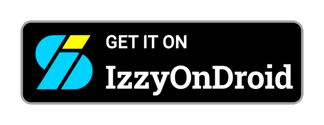
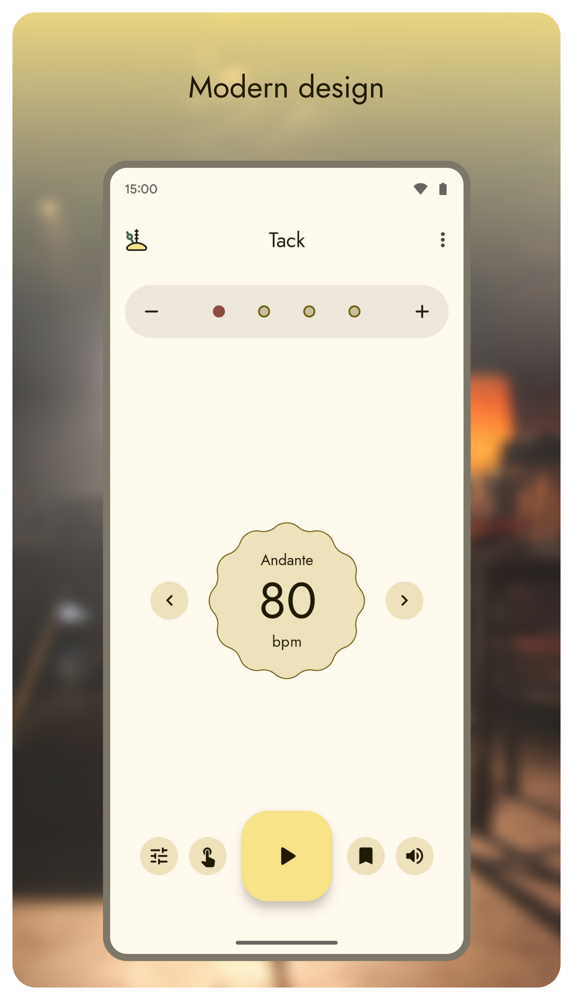
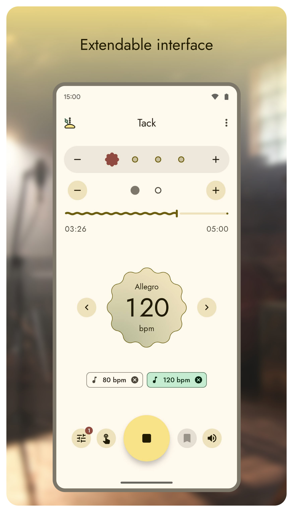
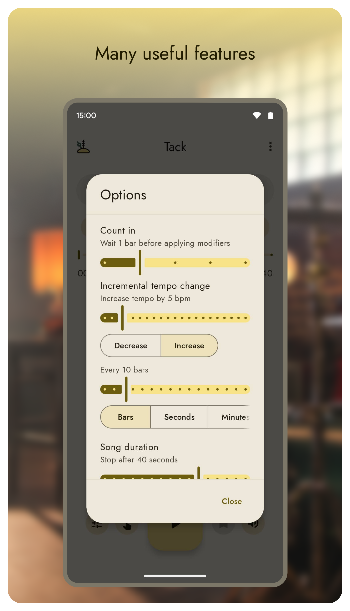
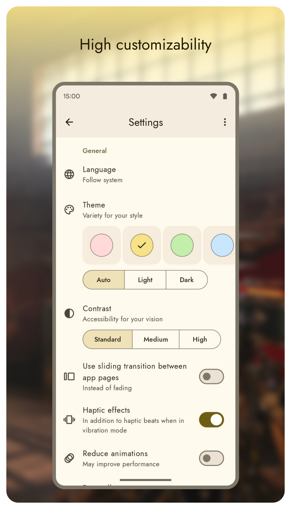
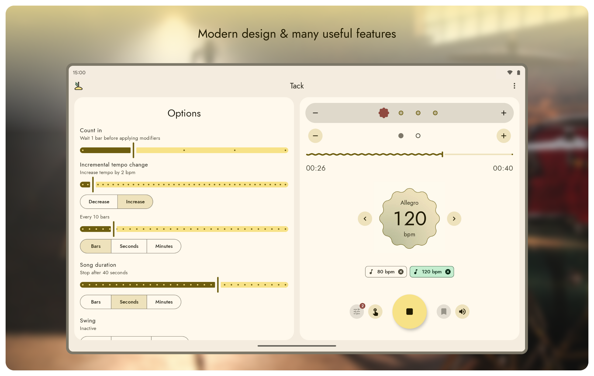
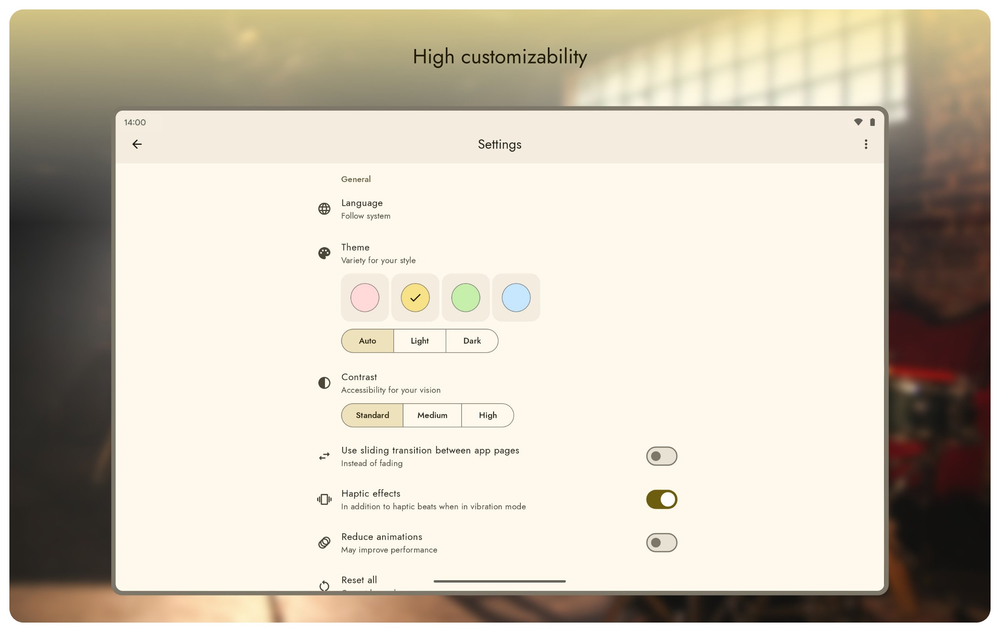
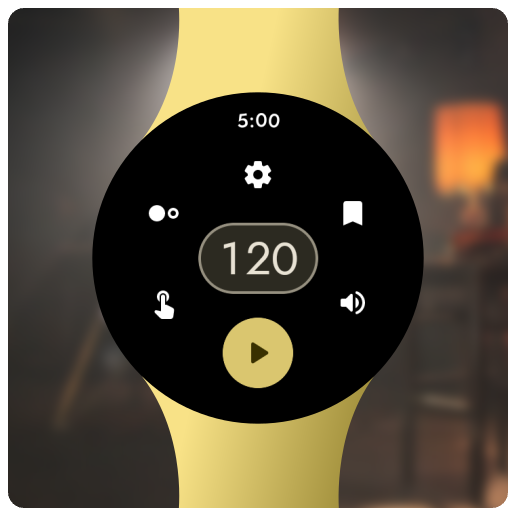
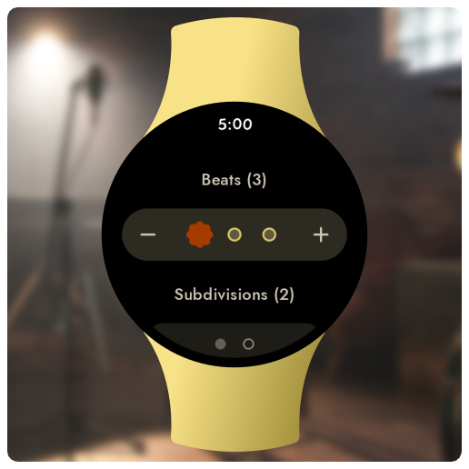
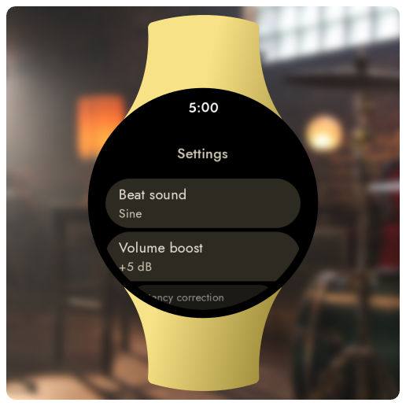

# Tack Android

    

Tack is a modern metronome app for Android with a beautifully designed interface that has all the features you need for practicing a music piece accurate to the beat.

There also is a standalone Wear OS app available with haptic beats and many options directly on your wrist.

## Downloads

## Screenshots

## Features

### Phone/Tablet

* Beautiful beat visualization with subdivisions and changeable emphasizes
* Song library for managing metronome configuration combinations
* Options for count in, duration, incremental tempo change, muted beats and swing
* Settings for flash screen, volume boost, audio latency correction and elapsed time
* Support for dynamic color, dynamic contrast and large screens
* No ads or analytics
 
### Wear OS

* Convenient tempo picker with separate tempo tap screen
* Advanced beat customization with changeable emphasizes and subdivisions
* Bookmarks for tempo, beats and subdivisions
* Settings for flash screen, volume boost and audio latency correction

## Compatibility

Tack for phones and tablets requires at least Android 5.0 Lollipop and works properly on devices without any Google service installed. The separate app for smartwatches requires at least Wear OS 1.0.

## Contribution

If you run into a bug or miss a feature, please [open an issue](https://github.com/patzly/tack-android/issues) in this repository.

Tack can be translated! The main language is English, but I also maintain the German translation.
You can help translate this project at [Transifex](https://app.transifex.com/patzly/tack-android) if your language is incomplete, contains typos or is not available yet. Translations which reached a completion level of 80% will be included in releases.  

Thanks for your contributions!

## License

Copyright &copy; 2020-2025 Patrick Zedler. All rights reserved.

[GNU General Public License version 3](https://www.gnu.org/licenses/gpl.txt)
